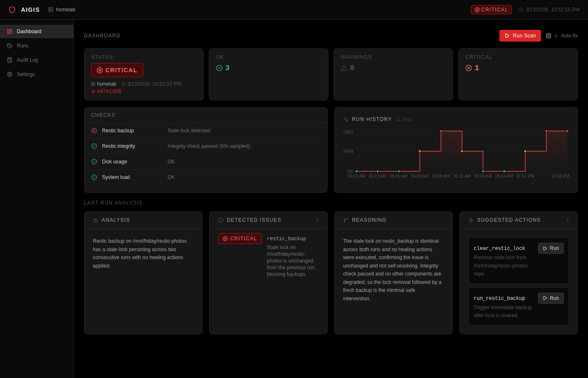
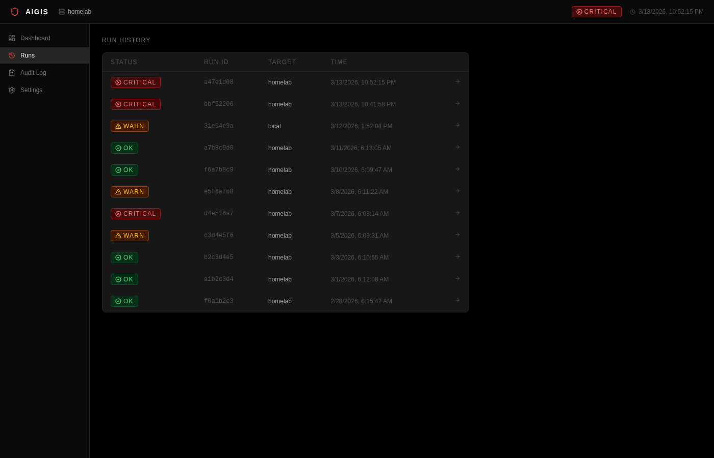
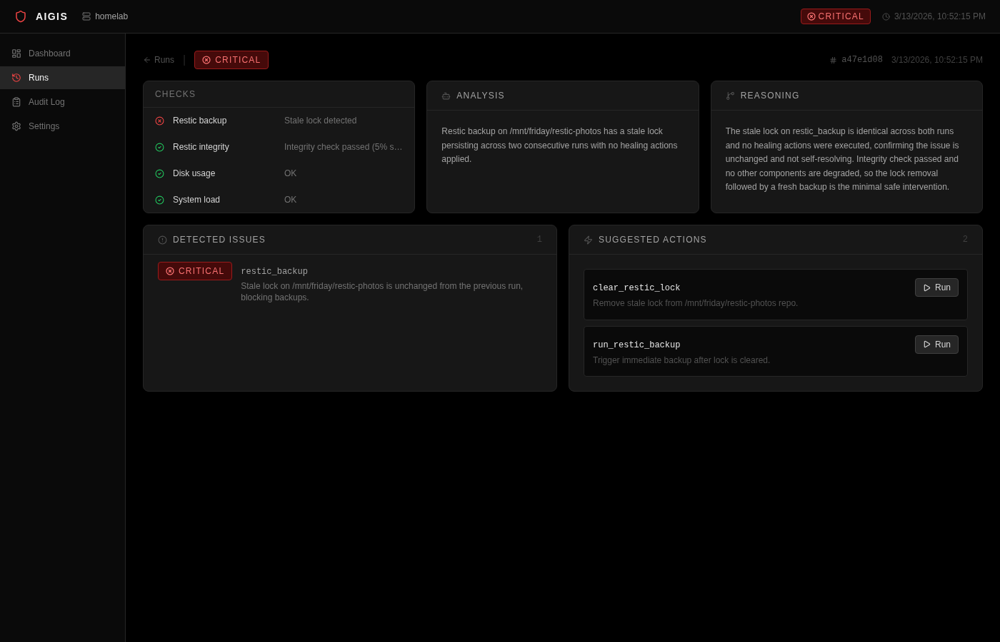

# AIgis

A safety-first monitoring agent for homelab and small-server infrastructure.

## What it does

AIgis collects system signals, runs rule-based health checks, and produces structured reports. It optionally uses Claude AI to explain anomalies and suggest remediation actions — with human approval before executing anything.

Monitors:
- Restic backup status
- Disk usage
- System load
- Network status
- Docker/container health

## Screenshots

### Dashboard



Real-time health overview with check results, run history chart, LLM analysis, and one-click suggested actions.

### Run History



Paginated log of every scan run with severity badges, target, and timestamp.

### Run Detail



Per-run breakdown: individual checks, detected issues, AI reasoning, and suggested remediation scripts.

## Requirements

- Python 3.12+
- `uv` package manager
- Restic (for backup checks)
- Docker (optional, for container health)

## Installation

```bash
uv sync
```

## Usage

```bash
# Run a monitoring scan
aigis run

# Run with LLM analysis + healing prompt
aigis run --fix

# Start the web dashboard
aigis serve
```

## Configuration

Copy and edit `config/default.yaml`. Set required env vars in `.env`:

```
ANTHROPIC_API_KEY=sk-ant-...
AIGIS_KEY=<fernet-key>   # required for password-auth targets
```

Generate a Fernet key:

```bash
aigis --generate-key
```

## License

[PolyForm Noncommercial License 1.0.0](LICENSE) — free for personal and non-commercial use; commercial use requires permission.
